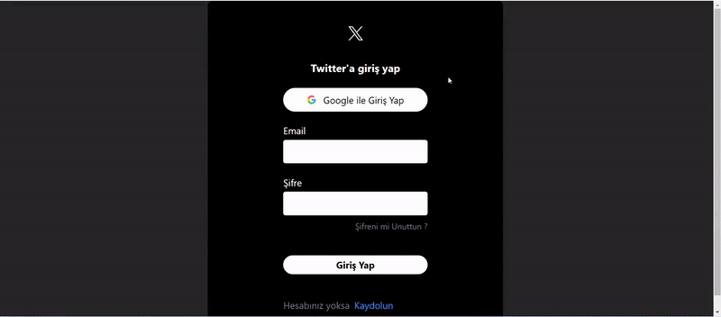

# Twitter Clone

## Project Description

This project is a clone of the popular social media platform Twitter, offering core functionalities similar to the original app. Built with Firebase for user authentication, real-time data management, and storage, this app provides users with a social media experience where they can post tweets, like, and comment.

## Features

- User Authentication: Sign up and login options via email or Google account.
- Tweet Posting: Share thoughts and media content.
- Real-Time Updates: Real-time data updates powered by Firebase.
- Profile Management: Personal account management with profile picture and user info.
- Responsive Design: Optimized UI for both mobile and desktop.

## Used Technologies

- React.js: For front-end development.
- Firebase: For authentication, Firestore, and storage.
- Tailwind CSS: For responsive and modern design.
- React Router: For page navigation.
- Moment.js: For date formatting and manipulation.
- React Toastify: For notifications.
- UUID: For generating unique IDs.
- React Icons: For using icons in the application.

## Development

To develop the project, you can use the following commands:

1. Clone the project.

   ```bash
   git clone https://github.com/emreertugrl/FB_Twitter_Clone.git
   ```

2. Navigate to the project directory:

   ```bash
   cd FB_Twitter_Clone
   ```

3. Install the dependencies:

   ```bash
   npm install
   ```

4. Start the development server:

   ```bash
    npm run dev
   ```

## Visual



## API's

No external APIs were used in this project.

## Contact

For any questions or suggestions, feel free to reach out:

- Email: emreertugrl7@gmail.com
- LinkedIn: [emreertugrul7](https://www.linkedin.com/in/emreertugrul7/)
